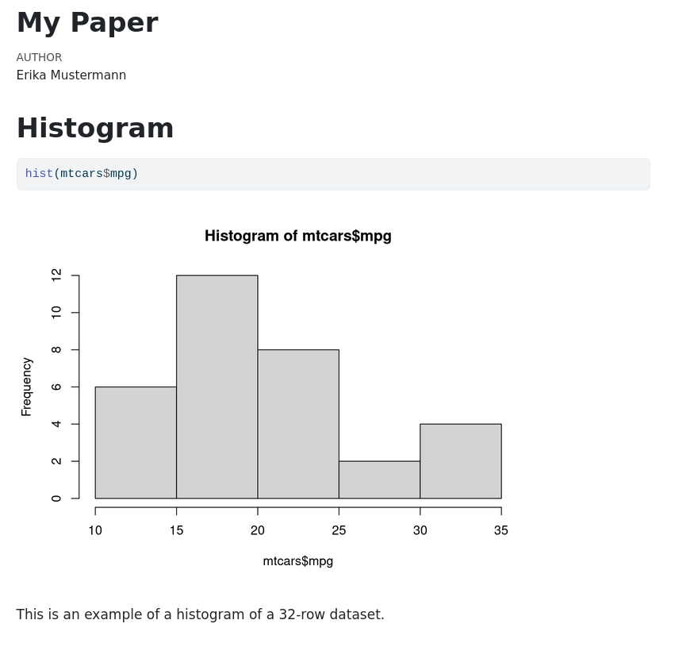

# Introduction

We will discuss literate programming and its roles in enhancing computational reproducibility. Quarto will be used as an exemplar method in this unit. In the next unit, Jupyter will be introduced.

# Literate programming

We write code to analyze our data. However, the final product of our research is usually not code. Instead, papers, slides, or blog posts for knowledge dissemination. By default, we copy (or transcribe) the output from the execution of our developed code into a report (e.g. your Microsoft Word document).

This process is error prone. Transcription errors, such as misplacing decimal point, incorrect rounding, or simply copying the wrong numbers, are not rare. Another source of transcription errors is forgetting to update the transcribed output in a report, when the code or data is updated.

A good solution to eliminate these transcription errors is to use literate programming. Instead of developing the code and the report separately, they are embedded together. Executing the code will then update the report automa*g*ically.

## Quarto and code embedding

There are several solutions for doing literate programming (org, sweave, pluto, dribble, or whatsnot) [1]. We will use [Quarto](https://quarto.org/), a markdown-based system, as an example in this unit.

Quarto is a markdown-based system, which uses two methods to embed code: code chunk and inline code. The following is an example of a Quarto document.

````markdown
---
title: My Paper
author: Erika Mustermann
output: html
---

# Histogram

```{r}
hist(mtcars$mpg)
```

This is an example of a histogram of a `r nrow(mtcars)`-row dataset.

````

The first part of a Quarto document is the yaml header. This part is optional, but it records the metadata of the document, such as title, author. It also instructs the rendering engine (in this case *knitr*) to what formats should this document be exported, e.g. HTML.

Then, the content of the document should be written in the [Markdown](https://quarto.org/docs/authoring/markdown-basics.html) format. For example, a sentence preceded with a hash is a heading. (e.g. `# Introduction`), two hashes is a subheading (e.g. `## Literature review`). Follow the above link for a complete reference of the syntax.

The section tagged with three backticks is a [code chunk](https://quarto.org/docs/computations/execution-options.html) (or code block). A code chunk started with curly braces indicates that this chunk should be executed. The output of the code execution will be inserted into the document.

Another way to embed code is to use [inline code](https://quarto.org/docs/computations/inline-code.html). For this rendering engine (*knitr*), inline code is tagged with one backtick. Similarly, the code inside will be executed and the output be inserted.

Suppose the above document was saved as "report.qmd". This document can be rendered (meaning execute the code as well as cover the markdown code to a the specified format) by running [2]:

```sh
quarto render report.qmd
```

The output, an HTML file ("report.html"), should look like this:



## Chunk options

There are [options](https://quarto.org/docs/computations/execution-options.html#output-options) to control how a code chunk should be executed. For example, you might not want the source code to be displayed (or "echoed" back to you) and set `echo` to `false`. This is particularly useful for code that reads and preprocess a dataset.

````markdown

```{r}
#| echo: false
library(janitor)
library(here)
library(dplyr)
library(readr)
library(stringr)
library(lubridate)

data_url <- "https://raw.githubusercontent.com/gesistsa/rang/refs/heads/v0.3/inst/turing/data_raw/penguins_raw.csv"

penguins_raw_df <- read_csv(data_url)

penguins_df <- penguins_raw_df %>%
  clean_names() %>%
  mutate(species_short = word(species, 1)) %>%
  mutate(sex = tolower(sex)) %>%
  mutate(year = as.integer(lubridate::year(date_egg))) %>%
  mutate(across(where(is.character), as.factor)) %>%
  mutate(flipper_length_mm = as.integer(flipper_length_mm)) %>%
  mutate(body_mass_g = as.integer(body_mass_g)) %>%
  rename(bill_length_mm = culmen_length_mm,
         bill_depth_mm = culmen_depth_mm) %>%
  select(species_short,
         island,
         bill_length_mm,
         bill_depth_mm,
         flipper_length_mm,
         body_mass_g,
         sex,
         year) %>%
  rename(species = species_short) %>%
    as.data.frame()
```

````

## Other formats

You can also render a quarto document into other formats (list of [all supported formats](https://quarto.org/docs/output-formats/all-formats.html)), either by changing the YAML header, or using `--to` option, e.g.

```sh
quarto render report.qmd --to pdf
```

## Appendix

PDF support requires LaTeX. Install a LaTeX distribution (`tinytex`) by

```sh
quarto install tinytex
```

# References

1. [Tutorial: Hello Quarto](https://quarto.org/docs/get-started/hello/rstudio.html)
2. GESIS Training [Automated Reports & Co with Quarto and Markdown](https://gesiscss.github.io/quarto-workshop/)

# Footnotes

[1]: No Kitchen Sink

[2]: Or click on the "Render" button, if you are using RStudio. 
